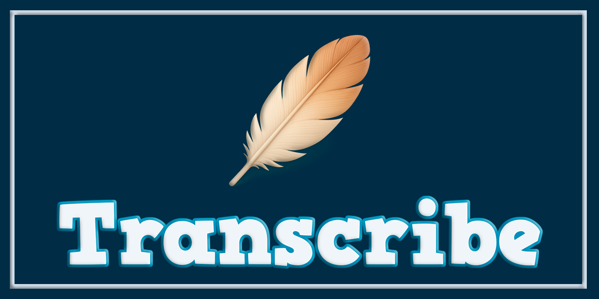

# 🎙️ Transcribe

### 🚀 Transcribe 2.0 (Python Edition)

⚠️ **Cambio incompatible** (Breaking change)
A partir de la versión 2.0, Transcribe ha sido reescrito completamente en Python y abandona definitivamente la implementación basada en VBScript.

La versión anterior se conserva únicamente con fines históricos bajo el tag:

```
v1.0-vbscript
```
---

#### ✨ Novedades principales

- ⌨️ Atajos de teclado nativos (sin scripts externos)
- 🔐 Ejecutables firmados digitalmente
- 📦 Distribución mediante instalador profesional para Windows
- 🧹 Eliminación total de VBScript y PowerShell en producción
---
---
#### 📥 Descarga e instalación
👉 Descargar `Transcribe_Setup.zip`, desde GitHub Releases
👉 Extraer el archivo ZIP
👉 Ejecutar el instalador Transcribe_Setup.exe

✔️ Compatible con Windows 10 y Windows 11
✔️ No requiere Python instalado
✔️ No requiere dependencias externas

---
Transcribe es una aplicación de escritorio desarrollada en **Python (Tkinter)** orientada a la **transcripción** profesional de **audio** y **video**, pensada como una suite para Windows, estable, ligera y firmada digitalmente.

El proyecto está diseñado para ofrecer una experiencia sólida al usuario final: sin dependencias frágiles en producción, con compatibilidad DPI, ejecutable firmado y un sistema de lanzamiento que inspira confianza.


---



---

## 🎯 Objetivo del proyecto

Transcribe nace con el objetivo de ofrecer una herramienta simple, confiable y profesional para convertir grabaciones de audio y video en texto, manteniendo una arquitectura limpia, una interfaz clara y un enfoque profesional en Windows.

El proyecto evita soluciones pesadas o inestables y prioriza la seguridad, la experiencia del usuario y las buenas prácticas de distribución.

---

## ✨ Características principales

* 🎙️ Transcripción de audio y video a texto
* ⌨️ Control mediante teclas rápidas F1, F2, F3 y F4 para reproducción y navegación
* 🗑️ **Botón "Borrar"**: Limpieza física y segura del medio cargado desde la interfaz.
* 📂 Soporte para múltiples formatos (WAV, MP3, MP4, MKV, entre otros)
* 🖼️ Interfaz escalable según DPI (HiDPI / 4K)
* 🎨 Uso de iconografía HD escalable y elementos gráficos modernos
* 🌐 Internacionalización (i18n)
* 🧠 Separación clara entre UI, configuración y utilidades
* 🪟 Ventana centrada y tamaño fijo
* 🔏 Firma digital de los scripts y ejecutables
* 🚫 Eliminación de dependencias inestables en producción
* 📦 Distribución mediante instalador profesional (.exe)

---

## 🖼️ Interfaz

* Diseño limpio y profesional
* Selección directa de archivos de audio o video
* Controles de reproducción (retroceder, reproducir, detener, avanzar)
* Slider de ganancia de decibeles
* Slider de volumen
* **Bloqueo Lógico**: Los controles se protegen durante la carga sin alterar la estética visual.
* Escalado automático según la resolución del sistema

---

## 🧱 Arquitectura del proyecto

```
Transcribe/
│
├── ui_main.py          # Punto de entrada principal de la interfaz
├── settings.py         # Configuración global (colores, tamaños, AppID)
├── hotkey_server.py    # Servidor de atajos de teclado (elevado)
│
├── core/               # Módulos de lógica (Audio, Player, Hotkeys, DPI)
├── gui/                # Componentes de la interfaz gráfica (Windows, Canvas)
├── images/             # Recursos gráficos HD y assets
├── images2/            # Capturas y recursos de documentación
├── installer/          # Scripts de instalación y manuales
└── requirements.txt    # Dependencias de desarrollo
```

---

## 📷 Capturas de pantalla

<p align="center">
  
</p>

---

## 🧠 Detalles técnicos destacados

* DPI Awareness activado para evitar imágenes borrosas.
* Escalado automático de iconos e interfaz según factor de resolución.
* **Seguridad de Hotkeys**: Se eliminó la captura global de la tecla `Supr` para evitar borrados accidentales fuera de la app.
* **Inmunidad de Salida**: El botón de cerrar permanece funcional incluso durante procesos de carga bloqueantes.
* Sistema de hotkeys ejecutado con elevación controlada en Windows.
* Ejecutable y scripts firmados digitalmente para mayor confianza en Windows.
* Instalación estándar en Program Files.

---

## 🚀 Ejecución Uso normal (recomendado)

* Descarga la última versión estable desde GitHub Releases:

👉 Descargar desde GitHub Releases:
https://github.com/Pablitus666/Transcribe/releases

Pasos:

  * Descarga el archivo .zip desde Releases
  * Extrae el contenido 
  * Ejecuta Transcribe_Setup.exe
  * Iniciar Transcribe desde el acceso directo
  * No requiere Python instalado ni dependencias externas

## Opción 2: Ejecución en desarrollo

  * cd Transcribe
  * crear el entorno virtual:
```
py -3.11 -m venv venv
```
  * activar el entorno virtual:
```
.\venv\Scripts\Activate.ps1
```
  * Instalar dependencias:
```
pip install -r requirements.txt
```
  * Ejecutar script principal:
```
python ui_main.py
```
---

## 📦 Estado del proyecto

- ✔️ Estable 
- ✔️ Listo para uso real
- ✔️ Enfoque profesional 
- ✔️ Compatible con Windows 10 / 11

---

## 🔮 Posibles mejoras futuras

* Procesamiento por lotes
* Historial de transcripciones
* Interfaz moderna opcional (CustomTkinter / PyQt)

---

## 📄 Licencia

Este proyecto se distribuye bajo la licencia **MIT**.

---

## 🤝 Contribuciones

Las contribuciones, sugerencias y mejoras son bienvenidas.  
Si encuentras un problema o tienes una idea, no dudes en abrir un *issue* o *pull request*.

---

## 👨‍💻 Autor

**Walter Pablo Téllez Ayala**  
Software Developer  
📍 Bolivia 🇧🇴  <br>
📧 [pharmakoz@gmail.com](mailto:pharmakoz@gmail.com) 

© 2026 — Transcribe Tool

---

⚖️ Nota legal

---

Este software está destinado al uso legítimo sobre grabaciones de audio de las cuales el usuario tenga autorización. El autor no se responsabiliza por el uso indebido de la herramienta.
